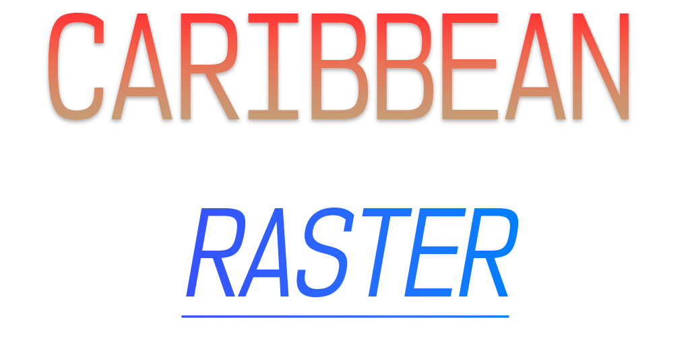

# Caribbean Raster

[](https://github.com/italrr/cr)

<p style="text-align: center; font-weight:bold; font-style: italic; font-size: 1.2em">Bringing You Savor In 'em Pixels 🔥</p>

Caribbean Raster (CR) is an indie oriented 3D game engine designed for RPG, Strategy and Simulation games. It's being developed in C++11 and features OpenGL 4.5 and Vulkan 1.3 out of the box. CR is designed to be very portable, aiming to support AMD64 and ARMv8. It will work on systems such as Linux, Windows, OS X, and the Steam Deck.
CR actually is the evolution of two differet game engines previously developed (now abandoned) by me:

- https://github.com/italrr/nite (Single threaded 2D game engine designed for RPG games made in C++11 and utilizing OpenGL 3.0 for rendering)
- https://github.com/italrr/astro (Highly concurrent 3D game engine designed for simulation/open-world games also made in C++11, and utilizes OpenGL 4.4/4.5, and Vulkan for rendering)

Early build test (Current version doesn't build this anymore):

[](https://www.youtube.com/watch?v=bo8umj15AYM)


# Features
- 3D & 2D rendering pipelines
- Multilayer (3D and 2D) rendering pipelines. Allowing to easily draw on both at the same time
- UTF-8/ASCII Font rendering with basic formatting included (such as auto line break and left/center/right alignment)
- Supported 3D Model formats: FBX/OBJ/CR3 (CR3 is CR's native 3D model format)
- Job system (CR::Job) for multhreading, and single threaded asynchronous event driven logic which includes convenient error handling through CR::Result
- Mouse, Keyboard, Gamepad and Touchscreen/trackpad support
- Robust networked world simulation system using a client/server architecture (Through UDP). Although P2P should also be possible with some work
- UDP/TCP abstraction layers
- File transfer system (Through UDP and using the same socket as the game/simulation)
- Resource management system
- Open world map system with resource streaming 
- Native types such as CR::Vec2/Vec3/Vec4, CR::Mat3/Mat4, CR::Color, CR::Polygon, etc. 
- Semi-robust Math tools included with the types mentioned, that should be enough for 3D graphics.
- Native types to facilitate moving data around (like in and out of sockets), such as CR::Packet and CR::SmallPacket
- Sound support and Dynamic Music system
- Granular entity/character stat, quest, and AI system aimed to replicate the pen and paper role playing experience
- Integrated UI system known as Flexie
- Integrated scripting language: Lua

## What?

CR aims to provide a persistent fully networked world simulation allowing for multiple players to have a fun and fully interactive experience. The world/map is fully streamed, which allows big maps with a good amount of moving parts. 

CR is quite moddable, with full Lua integration allowing for a lot of customization. Integrated file sharing allows for content to be delivered on the fly without restarting the game, that includes mods. CR works through only one UDP port. No need to open a bunch of ports.

###  Simulation

CR simulations work in terms of "Frames" or "Ticks". Both terms used interchangeably. A single frame happens every 16 milliseconds, making it 60 ticks in a second. Each tick is composed of "Audits". An Audit is an action, reaction, or change of state.

In terms of Animation the engine constantly interpolates between the new audit and the last one. The simulation is lockstepped.

The server will generated a tick every 16 milliseconds regardless if something happened or not, and will have it sent to the clients. The clients will "apply" the audit to their simulation in the same order they're received. Clients cannot miss a single audit since that would completely break the simulation.

### Flexie [WIP]

It's the UI module CR uses to render the user interface. It's based off [nite's UI system](https://github.com/italrr/nite/tree/master/src/Engine/UI). And it works using Flex boxes for layouts. Flexie UIs are built in JSON files, but with a little twist in which it's possible to have inline Lua code.
Example:
```
{
    "type": "window",
    "title": "Example",
    "width": "!! 50%",
    "height": "!$ use_ratio_x 0.3",
    "theme": "generic_theme.json",
    "layout": "vbox",
    "children": [
        {
            "type": "text",
            "text": "top text",
            "width: "100%",
            "flex": 3
        },
        {
            "type": "text",
            "text": "text in the middle",
            "width: "100%",
            "style": {"font-size": 48}
            "flex": 3
        },        
        {
            "type": "panel",
            "flex": 1,
            "layout": "hbox",
            "width": "100%",
            "children":[
                {
                    "type": "text", "text": "bottom left text", "height: "100%", "flex": 1                    
                },
                {
                    "type": "text", "text": "bottom right text", "height: "100%", "flex": 1                    
                }                
            ]                
        }
    ]
}
```

## Requirements

- C++11 capable compiler (with C++11 standard library available. Preferably GCC)
- AMD64/x64 or ARMv8. Other architectures might work.
- OpenGL 4.5 or Vulkan 1.3 GPU capable GPU
- 1024MB VRAM
- 4GB RAM
- Windows, Linux or OS X (Although other *NIX might work)

## Dependencies

- GLFW3
- Vulkan 1.3 and/or OpenGL 4.4/4.5 (Either can be disabled)
- Assimp 4.0 or higher
- FreeType 2
- OpenAL 1.1 or higher
- pthreads 
